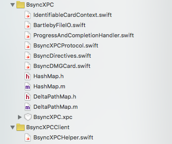
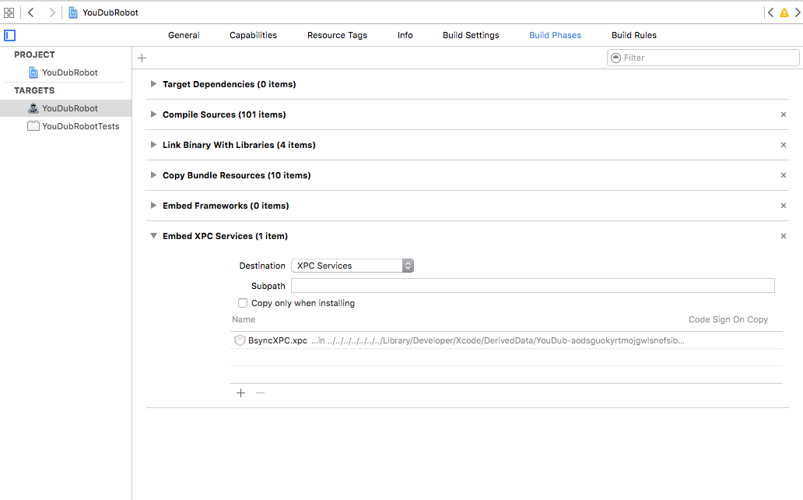

# BsyncXPC 

Is an **XPC interface** built on the top of **bsync**

It allows to: 

- create, attach and detach dmgs.
- create and validate synchronisation directives.
- run synchronization directives.
- and integrates a local file system API that implements *BartlebyFileIO* protocol.

## BUILD SETTINGS

# BsyncXPC's BUILD SETTINGS and compilation tricks 

We use advanced build settings to allow mixmatch and to compile BsyncXPC.

1. We embed sources -> check the group Embedded-Modules.
2. We -DUSE_EMBEDDED_MODULES in "Other swift flags" (To compiles directly Bartleby's sources)
3. We -DUSE_BSYNC_XPC_OBJC  in "Other C flags" (to discriminate the XPC use case within the objc classes)
4. To support a Full Swift XPC Service we add to add  "Run path search path : @loader_path/../../../../Frameworks"

**I will furnish a binary distribution when the Service will be mature and fully tested.**


# Integration in a client app

A product that uses BSyncXPC **MUST**:

## Expose a few files coming from BartlebyKit, bsync & BSyncXPC ##



- BartlebyKit/BartlebySources/core/protocols/BartlebyFileIO.swift
- bsync/Commands/ProgressAndCompletionHandler.swift
- bsync/bsyncLibsources/Swift/BsyncDirectives.swift
- bsync/bsyncLibsources/Swift/BsyncCredentials.swift
- bsync/bsyncLibsources/Swift/BsyncDMGCard.swift
- BsyncXPC/BsyncXPCProtocol.swift
- bsync/bsyncLibsources/Objc/HashMap.h
- bsync/bsyncLibsources/Objc/HashMap.m
- bsync/bsyncLibsources/Objc/DeltaPathMap.h
- bsync/bsyncLibsources/Objc/DeltaPathMap.m

You have to add your objc Bridging header.


```
#import "HashMap.h"
#import "DeltaPathMap.h"
```


In future releases when the swift port will be finished this procedure will be simplified.


## And Embed the XPC service. ##

**TODO** write explanations



For more detailled explanation read Creating XPC services [Apple documentation] (https://developer.apple.com/library/mac/documentation/MacOSX/Conceptual/BPSystemStartup/Chapters/CreatingXPCServices.html)

## BsyncXPCHelper ##

I developped very useful helper class to help you operate with DMG. 

```
Bartleby/BsyncXPCClient/BsyncXPCHelper.swift
```

You should use it as a base to implement your client logic it simplify the mount / thenDo / unmount logic.


# Usage #

You can invoke any of the method of the **BsyncXPCProtocol** and also all the methods of the **BartlebyFileIO** protocol.

## 1 Instanciate the XPC connection ##

```swift
    lazy var bsyncConnection: NSXPCConnection = {
        let connection = NSXPCConnection(serviceName: "fr.chaosmos.BsyncXPC")
        connection.remoteObjectInterface = NSXPCInterface(withProtocol: BsyncXPCProtocol.self)
        connection.resume()
        return connection
    }()
```

## 2 Grab the remote proxy ##

```swift
    let syncProxy=bsyncConnection.remoteObjectProxyWithErrorHandler { (error) -> Void in
        print ("Error \(error)")
    } as! BsyncXPCProtocol
    ...
```

## 3 Invoke for example the create image disk method ##

```swift
    syncProxy.createImageDisk("\(p)\(project.name!)", volumeName: project.name!, size: "10g", password:password)
            { (sucess, message) -> () in
            print("Success \(sucess) \(message)")
    }
```


